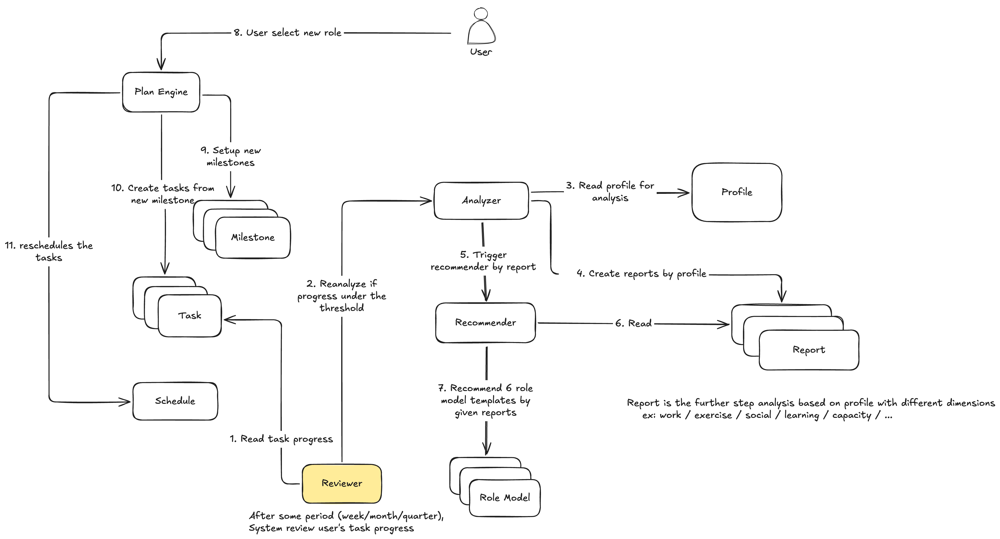

<div align="center">

# Life Guru

**繁體中文**（本頁） · [English](README.en.md)

**讓人生目標有依據，讓每天行動有方向。**

一款個人成長 AI 教練，幫助有成長意願、卻難以持續行動的人，
找到值得投入的方向，把目標轉換成符合自身能力與時間的行動計畫，並透過持續回饋調整步調。


[](https://wu0h9625-boop.github.io/guru-intake-prototype/)


</div>

---

## 問題與目標

Life Guru 要降低兩種成本：

| | 成本 | 長什麼樣子 |
|---|---|---|
| **1** | **不知道方向的成本** | 反覆規劃，到頭來沒開始，原地踏步 |
| **2** | **計畫中斷的成本** | 開始之後，因為計畫不符合生活型態而停下來 |

**目標使用者**是有成長意願、卻難以持續行動的人——有工作、有行事曆、有履歷，
知道現在不太對，但說不出想去哪裡，也沒有立場去寫一份五年計畫。

問題的根源在於：**「你的願景是什麼」是一道要人無中生有的題。**
市面上每一個目標管理產品都從這裡開始問；對已經知道答案的少數人來說沒問題，
對其他人來說，那是第一個畫面就撞上的牆。

所以 Life Guru 不從提問開始，而是**從使用者已經留下的資料開始**，
讓使用者先看見自己的現況，再用簡短問答補足資料無法解釋的部分。
這些資訊共同構成後續規劃的依據，**減少使用者從零整理自己的負擔**。

> **產品的核心原則：**每一項建議都應該讓使用者知道
> **為什麼值得嘗試、需要付出什麼，以及今天可以如何開始。**

**預期影響**：把「我不知道我要什麼」變成一個可以往下走的答案，
並且讓計畫能隨生活變動而延續，而不是中斷。

## 核心功能

系統由兩條主要流程構成，對應上面那兩種成本。

**1 · 探索 Role Model（`explore role model`）——解決「不知道方向」**

- **從既有資料開始**——匯入 Google 行事曆與履歷 PDF，不要求使用者回想或開始記錄
- **先看見現況**——建立每人唯一一份 Profile，並產生多面向 Report
  （工作／運動／社交／學習／容量），未分類的時間也是第一級結果
- **簡短問答補足缺口**——補上資料無法解釋的部分：不願接受的條件、
  願意分配到這件事的時間；每一題都可以跳過
- **用 Role Model 具體比較不同的生活與工作方式**——每個方向都呈現
  **需要累積的能力、投入與取捨**，並對照個人資料說明
  **目前有哪些基礎、還有哪些缺口**
- **使用者保有主導權**——建議的理由是攤開的，使用者可以補充或修正 AI 的判斷

**2 · 檢視任務進度（`review task progress`）——解決「計畫中斷」**

- **把方向拆成里程碑與具體任務**——Milestone 可巢狀，Task 在 Milestone 底下維持單層
- **依可用時間安排每日行動**——排到真實日期上，並尊重使用者願意投入的程度
- **完成紀錄與定期回顧**——Reviewer 每週／每月／每季讀取任務進度
- **診斷卡關的來源**——判斷卡關是因為**任務太大**、**時間不足**，
  還是**目標本身需要調整**
- **重新規劃**——需要調整方向時重跑分析與推薦；使用者選了新的 Role Model 之後，
  Plan Engine 重建 Milestone、Task 並重新排程

> **設計上的關鍵決定：**Recommender 不直接看 Profile，而是看多面向的 Report。
> 借用 CoT（chain of thought）的想法：先產生中間、可檢視的證據再推理，
> 不但推論精準度更好，也讓每一個建議都**可以被使用者反駁**——
> 這正是「使用者保有主導權」在技術上的實作方式。

## 系統架構

### 流程一 · 探索 Role Model


### 流程二 · 檢視任務進度



### 各層如何協作

| 層 | 元件 | 職責 |
|---|---|---|
| **前端** | `guru-app` | 上傳介面、Report 檢視、Role Model 選擇、每日任務與進度回報 |
| **後端 · API** | API Service | 認證、OAuth、檔案上傳與解析、所有對前端的 endpoint、工作派送 |
| **後端 · 規劃** | Plan Engine | Milestone 樹、Task 產生、**決定性**排程與重新排程 |
| **後端 · 回顧** | Reviewer | 定期讀取任務進度，診斷卡關來源並在需要時觸發重新分析 |
| **後端 · 推薦** | Role Model Service | Role Model 樣板查詢與 LLM 推薦 |
| **AI 模型** | LLM（xAI Grok） | 只做判斷：分析 Report、產生 Role Model 建議與理由、產生計畫模板 |
| **資料庫** | PostgreSQL · Redis | 前者存所有狀態，後者做佇列與快取 |
| **外部服務** | Google Calendar · Cloudflare R2 | 行事曆匯入與匯出、上傳檔案儲存 |

**LLM 只負責判斷，不負責算數。** 排程、時間計算與進度比對都是決定性的程式碼——
同樣的輸入必須得到同樣的結果，否則「這次卡關是因為任務太大還是時間不足」
就是在跟雜訊比較。

完整的領域模型、不變量、佇列工作與 LLM 邊界，見 [`SYSTEM-DESIGN.md`](SYSTEM-DESIGN.md)。

## 使用技術

| 類型 | 技術／服務 | 用途 |
| --- | --- | --- |
| AI 模型 | xAI Grok（`grok-4.6`，預設） | 分析 Profile 產生 Report、推薦 Role Model、產生計畫模板 |
| AI 模型 | Anthropic Claude／本地 Ollama · vLLM（可切換） | 同上；透過 `LLM_ADAPTER` 環境變數切換，不需改動程式碼 |
| 前端 | React 19 · Next 16（vinext）· Vite · Tailwind v4 | 網頁客戶端 |
| 前端 | Cloudflare Workers | 前端部署 |
| 後端 | Python 3.12 · FastAPI · SQLAlchemy 2（async）· Alembic | API 服務與資料存取 |
| 後端 | ARQ · Redis 7 | 非同步工作佇列（解析、產生計畫、重新規劃、匯出） |
| 後端 | PostgreSQL 16 | 主要資料庫 |
| 後端 | Cloudflare R2 | 上傳檔案物件儲存 |
| 外部服務 | Google OAuth 2.0 · Google Calendar API | 登入，以及行事曆匯入／匯出 |
| Sponsor 技術 | _TODO：請填入實際使用的 Sponsor 技術與用途_ | |

## 安裝與執行

需要 Python 3.12、[uv](https://docs.astral.sh/uv/)、Node.js ≥ 22.13、PostgreSQL 與 Redis。

```bash
# 1 · 後端 guru-core
git clone git@github.com:Quasar-Gang/guru-core.git && cd guru-core
uv sync
cp .env.example .env                  # 設定 DATABASE_URL / REDIS_URL / LLM_API_KEY / GOOGLE_CLIENT_ID
uv run alembic upgrade head           # 建立資料庫 schema
uv run python -m cmd.seed_role_models # 載入 Role Model 樣板
make check                            # ruff → mypy --strict → import-linter → pytest

# 啟動四個 process
uv run python -m cmd.api_server          # HTTP, port 8000
uv run python -m cmd.api_worker          # import.parse · export.push
uv run python -m cmd.plan_engine_worker  # plan.generate · continue · revise
uv run python -m cmd.role_model_server   # HTTP, port 8001

# 或用容器一次啟動（build + up + migrate + seed）
make deploy env=local
```

```bash
# 2 · 前端 guru-app
git clone git@github.com:Quasar-Gang/guru-app.git && cd guru-app
npm install
cp .env.example .env.local            # NEXT_PUBLIC_API_BASE_URL=http://localhost:8000
npm run dev                           # http://localhost:3100
```

> 未設定後端時，前端會退回內建的示範資料，互動仍可操作。

## 作品展示

- 作品展示網址：<https://wu0h9625-boop.github.io/guru-intake-prototype/>（流程一的上傳與方向原型）
- 評選影片：_TODO：請填入影片連結_

## 限制與未來工作

**目前限制**

- 流程一的**上傳與方向**已由原型完整驗證；**流程二（檢視任務進度）目前是設計，尚未經原型驗證**
- 原型使用示範資料，尚未串接真實的 Google 行事曆與履歷解析
- 兩個程式碼儲存庫（`guru-core` / `guru-app`）目前實作的是較早的「先問目標」模型，尚未收斂到本文件描述的設計
- Reviewer 的觸發門檻、以及「任務太大／時間不足／目標需調整」三者如何自動判別，尚未定案（見 [`SYSTEM-DESIGN.md`](SYSTEM-DESIGN.md) 的待決問題）
- 匯出目前只支援 Google Calendar 與 Markdown；Notion、Google Sheets 尚未實作

**後續方向**

- 把 Reviewer 從固定週期改為行為偏移偵測，讓它在真正需要時才出現
- 讓使用者自己撰寫 Role Model 樣板，而不只從內建的六個挑
- 信用卡帳單匯入，補上金錢流向這一個面向
- 行事曆變更偵測與自動重新排程

## 第三方服務、資料與素材

| 項目 | 來源／連結 | 授權／使用方式 |
|---|---|---|
| xAI Grok API | <https://x.ai/api> | 商用 API，金鑰以環境變數 `LLM_API_KEY` 提供，未進版控 |
| Anthropic Claude API | <https://www.anthropic.com/api> | 同上，可切換的替代供應商 |
| Google OAuth 2.0 · Calendar API | <https://developers.google.com/calendar> | 使用者授權後存取；refresh token 加密存放，前端不接觸 Google token |
| Cloudflare Workers · R2 | <https://developers.cloudflare.com/> | 部署與物件儲存 |
| PostgreSQL | <https://www.postgresql.org/> | PostgreSQL License |
| Redis | <https://redis.io/> | RSALv2 / SSPLv1 |
| FastAPI · SQLAlchemy · Alembic · ARQ | 各自官方儲存庫 | MIT／BSD 系列開源授權 |
| React · Next.js · Vite · Tailwind CSS | 各自官方儲存庫 | MIT |
| Plus Jakarta Sans · Noto Sans TC（原型字體） | <https://fonts.google.com/> | SIL Open Font License 1.1 |
| 原型示範資料 | 團隊自行撰寫的虛構使用者 | 非真實個人資料 |

> 儲存庫內未提交任何金鑰、Token 或個人資料；所有憑證皆由環境變數提供，
> `.env.example` 只列出欄位名稱。

## 團隊成員

| 姓名 | 分工 |
| --- | --- |
| _TODO_ | _TODO_ |

## License

Proprietary. Copyright (c) 2026 Quasar-Gang, all rights reserved.
版權所有，未經書面同意不得使用、重製、修改或散布。

> _TODO：請在儲存庫根目錄加入 `LICENSE` 檔案。_
