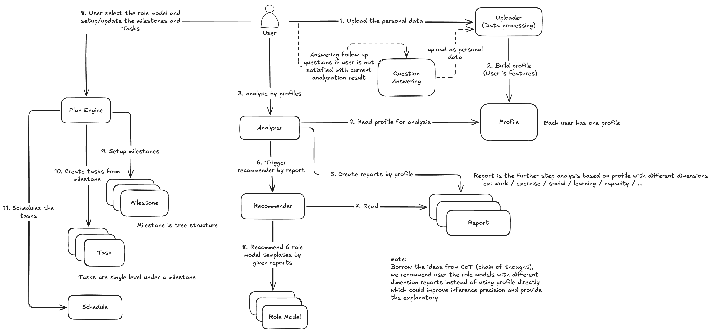

# guru

**English** (this page) · [繁體中文](README.zh-TW.md)

**Find the shape your own data already supports, and one experiment to test it.**

Nobody can answer *"what is your vision?"* — it asks you to invent something from nothing.
So this system never asks. It reads the data you already have, offers six borrowed shapes a
life can take, says which one your behaviour actually supports, and hands back a direction
you can prove wrong inside one quarter.

[Why it works this way](#why-it-works-this-way) · [The six shapes](#the-six-shapes) ·
[Specification](SYSTEM-DESIGN.md) · [Try the prototype](https://wu0h9625-boop.github.io/guru-intake-prototype/)

---

<b>The whole system.</b> Upload → Profile → Reports → six Role Models → Milestones, Tasks, Schedule. Every step is specified in <a href="SYSTEM-DESIGN.md">SYSTEM-DESIGN.md</a>.

---

## Why it works this way

Four ideas. Everything else in the design follows from them.

**1 · Read, don't ask.** You have left evidence for years — where your hours went, what
your résumé repeats, what you quietly stopped doing. It won't say what you *want*, but it
says what shape you're in, which is enough to borrow one and test it. The gap between what
someone claims to value and where their time and money actually go **is** the diagnosis.

**2 · Every shape states its cost.** A template with no stated trade-off is a popularity
contest, won by whichever sounds best out loud.

**3 · One cheap test, not a five-year plan.** Someone without direction needs one
experiment — finished inside a quarter, clear result, failure doesn't hurt. A test whose
failure is survivable is a test that gets run.

**4 · The output is a hypothesis, never a vision.** Dated, sourced, and **never
overwritten** — because one you can quietly edit is one you'll rewrite to match whatever you
ended up doing, and learn nothing from. A quarter later the system raises it unprompted: not
to nag you into executing, but to ask whether this shape still counts.

It chooses nothing. It reads, shows the evidence, states costs, and hands the decision back.

## The six shapes

Borrowed templates, not occupations — one job title can grow into different shapes. Users
can write their own.

| | Shape | The cost it names |
|---|---|---|
| **S-1** | **The Deep Specialist** — go deep on one thing, be known for it by your peers | Switching tracks gets expensive as depth grows |
| **S-2** | **The Zero-to-One Builder** — always making something that didn't exist | Little reaches maturity; the résumé looks jumpy |
| **S-3** | **The Independent Operator** — set your own hours, cover your own costs | Unstable income, no leverage, all the admin is yours |
| **S-4** | **The People Leader** — multiply through others instead of doing it yourself | Your hands-on craft decays; results become indirect |
| **S-5** | **The Steady Anchor** — predictable work, weight on relationships and health | The career ceiling arrives earlier; income flattens |
| **S-6** | **The Cross-Domain Connector** — stand between fields and translate | Deepest in none; constant explaining of what you do |

Picking one is not a commitment — it just gives the next step something to compare against.

## Read next

| | |
|---|---|
| [**Try the prototype**](https://wu0h9625-boop.github.io/guru-intake-prototype/) | The intake flow, running — six screens, no question until the fifth |
| [**`SYSTEM-DESIGN.md`**](SYSTEM-DESIGN.md) | The specification: concept model, language, all three stations, domain model and invariants, services, jobs, LLM boundary |
| [`excalidraw/guru_core_concept.excalidraw`](excalidraw/guru_core_concept.excalidraw) | The canvas above, editable |

## License

Proprietary. Copyright (c) 2026 Quasar-Gang, all rights reserved. No licence to use, copy,
modify or distribute is granted without written permission.
