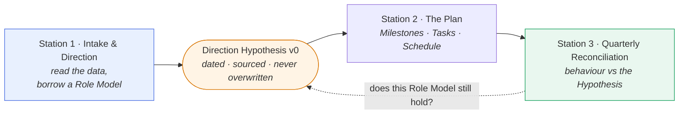
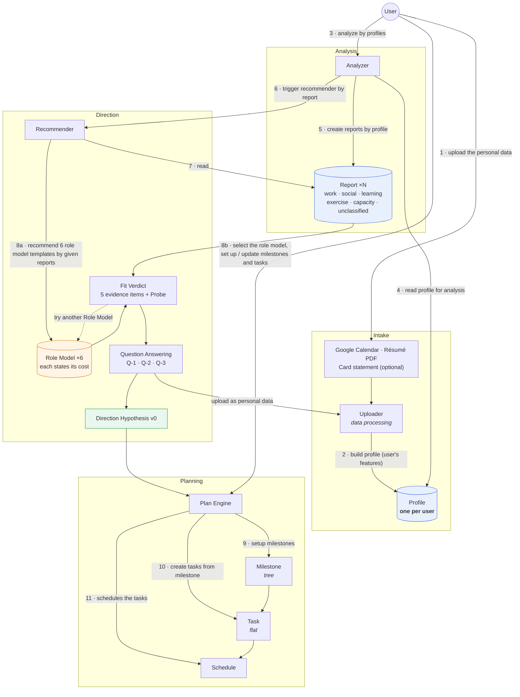
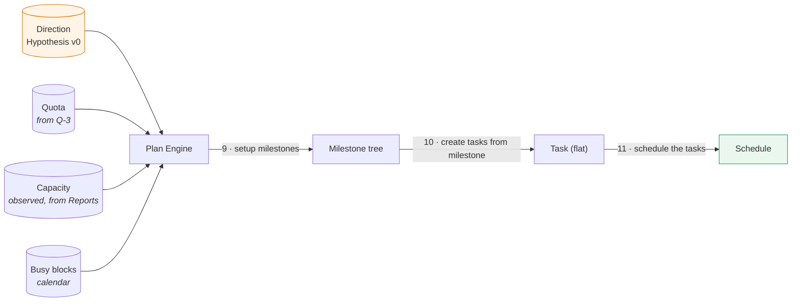
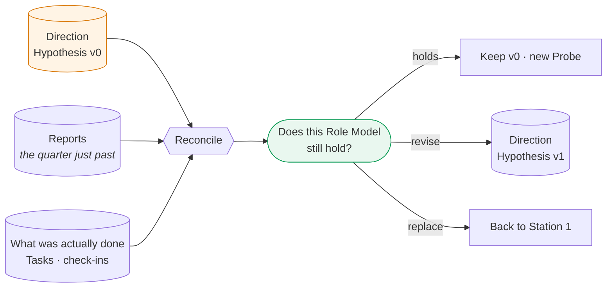
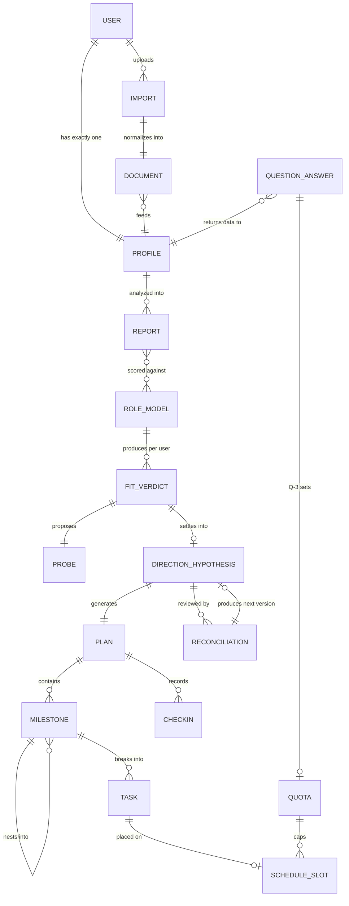
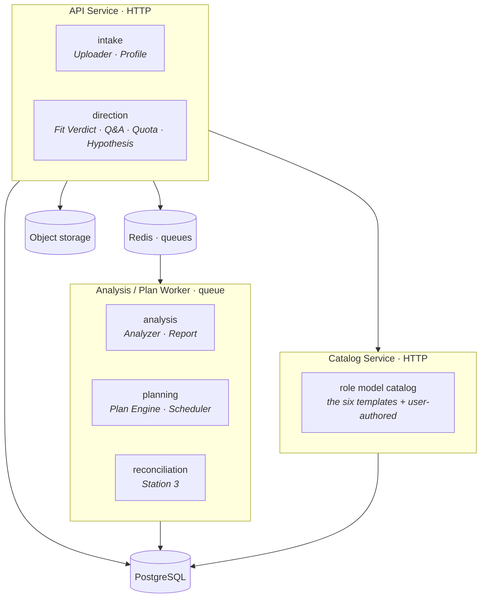

# guru — system design

*Implementation specification. [`README.md`](README.md) covers the product philosophy —
why the system reads instead of asking. This document covers the model and the mechanism.*

**Status of each station**

| Station | Status |
|---|---|
| 1 · Intake and Direction | **Verified end-to-end by the prototype** |
| 2 · The Plan | Designed from the concept canvas — **not yet prototype-verified** |
| 3 · Quarterly Reconciliation | Designed from the concept canvas — **not yet prototype-verified** |

## Contents

- [The three stations](#the-three-stations) — the loop
- [The concept model](#the-concept-model) — the canvas's eleven steps
- [The language](#the-language) — the ubiquitous vocabulary
- [Station 1 · Intake and Direction](#station-1--intake-and-direction)
- [Station 2 · The Plan](#station-2--the-plan)
- [Station 3 · Quarterly Reconciliation](#station-3--quarterly-reconciliation)
- [Domain model](#domain-model) — aggregates and invariants
- [System design](#system-design) — contexts, jobs, the LLM boundary
- [Open questions](#open-questions)

---

## The three stations



**The loop is the product.** A quarter is short enough that a wrong direction costs one
season instead of five years, and long enough that behaviour has time to say something.
Station 3 does not score anyone — it reconciles what was actually done against what the
Direction Hypothesis predicted, and asks whether the Role Model still counts. Answer that,
and Station 1 runs again with a `v1`.

---

## The concept model

The concept canvas redrawn. Step numbers are preserved exactly as drawn, so this diagram
stays checkable against the source.



Two structural decisions carry the design.

**The Analyzer is a separate step, and the Recommender never sees the raw Profile.** From
the canvas, verbatim:

> Borrow the ideas from CoT (chain of thought), we recommend user the role models with
> different dimension reports instead of using profile directly, which could improve
> inference precision and provide the explanatory.

Handing the whole Profile to a model and asking *which Role Model fits this person* yields
one unexplainable leap. Going through Reports first gives the Recommender intermediate,
inspectable evidence to reason over — better precision, and a verdict the User can argue
with. It is also what makes the Fit Verdict's citation rule enforceable: every evidence
item points at a Report row that exists.

**Question Answering returns to the Uploader, not forward.** Answers re-enter as personal
data, changing the Profile, the Reports, and every verdict downstream. Disagreement is an
input to the pipeline, not an exception path around it.

**The canvas numbers step 8 twice** — once for the Recommender's output, once for the
User's selection. This document splits that into `8a` and `8b`; the concepts that live in
the gap are the four proposals below.

---

## The language

The team's vocabulary lives on the concept canvas. Every noun below is drawn there, except
the four marked as proposals.

| Term | What it names |
|---|---|
| **User** | The person. Makes the choices. The system never chooses for them. |
| **Uploader** | Takes personal data in and normalizes it. *(canvas: "data processing")* |
| **Profile** | What the personal data adds up to — the system's read of who the User is now. **One per user.** |
| **Analyzer** | Reads the Profile and produces the Reports. |
| **Report** | Analysis of the Profile along one dimension. Many per Profile. |
| **Recommender** | Scores Role Models against the Reports. |
| **Role Model** | A borrowed template: a five-year path, what must accumulate, and its **cost**. |
| **Question Answering** | Puts questions to the User; answers return as personal data. |
| **Plan Engine** | Builds the Plan: Milestones, Tasks, Schedule. |
| **Plan** | What the User ends up executing. |
| **Milestone** | A checkpoint. **Milestones form a tree.** |
| **Task** | A concrete unit of work. **Single-level under a Milestone.** |
| **Schedule** | Tasks placed on real dates. |

### Four terms the canvas does not name — proposed, not yet ratified

The prototype needs four concepts the canvas has no word for. They are listed separately so
the team can adopt, rename or reject them deliberately rather than absorb them by accident.

| Proposed | What it names | Sits between | Evidence from the prototype |
|---|---|---|---|
| **Fit Verdict** | The Recommender's output for **one** Role Model and **one** User: a fit rating, a one-line verdict, a coach note, and exactly five evidence items each marked for/against and citing a Report fact | `Recommender` → `Role Model` | Screen `04 · 對照 CROSS-CHECK`; the `fit / verdict / say / items[5]` fields |
| **Probe** | The single cheap experiment attached to a Fit Verdict, sized to one quarter, carrying its own cost | hangs off `Fit Verdict` | `這一季唯一要驗證的事` and its cost line, e.g. *"一季一次 · 約 3 個晚上 · 失敗只是沒被接受，不影響工作"* |
| **Quota** | The standing allowance set by Q-3, capping what the Schedule may place and fixing the cut order when capacity runs short | `Question Answering` → `Schedule` | `累積型常設名額，以及容量不足時先砍誰` |
| **Direction Hypothesis** | An immutable, dated, versioned record of the chosen Role Model, the evidence behind it, and a review date | `Fit Verdict` → `Plan Engine` | Screen `06 · 產出 HYPOTHESIS`; `版本 v0 · 永不覆寫` |

**Why the canvas has no word for these:** on the canvas every arrow points forward — nothing
returns from Schedule, Task or Milestone. That is a correct description of a single pass,
but the product is a loop, and a loop needs something to compare against. The Direction
Hypothesis is that something; the return edge is what Station 3 rides.

---

## Station 1 · Intake and Direction

*Prototype-verified.* Six stages. **No question is asked until stage 5.**

```
01 INTAKE  →  02 READ  →  03 SHAPE  →  04 CROSS-CHECK  →  05 CONSTRAINTS  →  06 HYPOTHESIS
 Uploader     Analyzer    Recommender    Fit Verdict     Question Answering    Direction
 + Profile    + Reports   + Role Models  + Probe          + Quota              Hypothesis v0
```

### 01 · Uploader — read what already exists

No recall exercise. No "start tracking for two weeks." Three sources, **two of which are
enough to begin**:

| Source | What it gives | Required |
|---|---|---|
| **Google Calendar** | Where time flows — where the hours actually went | yes |
| **Résumé PDF** | Trajectory, and which skills keep reappearing | yes |
| **Credit card statement** | Where money flows — broadest coverage across dimensions | optional, can be added later |

> Time and money together are the most honest proof of priority. What a person claims to
> value, and where they actually put their resources — that gap is itself the diagnosis.

The Uploader parses and normalizes everything into the **Profile**. One Profile per user;
it is revised, never duplicated.

### 02 · Analyzer — the data speaks before you do

> You haven't answered a single question yet, but your data has already said plenty.

The Analyzer reads the Profile and emits one **Report** per dimension. This is a
user-facing screen placed deliberately *before* any question: the system lays out the
accounts and offers no judgement.

Six read-outs come off the Reports: **trajectory**, **skills** (what repeats),
**continuity** (unbroken streaks), **voids**, **signals** (things pointing the other way),
and **unclassified**.

*Worked example, from the prototype's demo user — 26 weeks, 448 events:*

| Read-out | Value |
|---|---|
| Time mix | 62% work · 16% unclassified · 14% social · 5% learning · 3% exercise |
| Trajectory | 5 years, 3 jobs, one field; longest tenure is the current one (2y 4m) — **lengthening, not shortening** |
| Skills | Figma, user interviews, design systems — present in all three jobs |
| Continuity | A Thursday reading group, **11 weeks unbroken** — the only long continuous behaviour |
| Voids | Weekends almost empty; **zero side-project traces**; exercise present for six weeks, then zero |
| Signals | **3 headhunter conversations in 3 months**, across 3 companies — pointing away from deepening |
| Unclassified | 16%, roughly **118 hours**, fits nowhere |

**Unclassified is a first-class Report dimension, not a classification failure.** The system
flags it as the most valuable column for the later reconciliation. Unnamed time is where the
difference between the life someone describes and the life they run tends to hide, so it is
kept visible rather than tidied away.

### 03 · Recommender — six Role Models, all scored

The Recommender reads the Reports and scores **all six** Role Models. It does not narrow
to one, and it does not choose.

> These are not occupations. They are shapes a life can take — the same job title can grow
> into different shapes, and different job titles can be the same shape.

Each Role Model is a template with six fields — `code`, `name`, `vision`,
`five_year_path`, `must_accumulate`, `cost`. **All six are properties of the template and
are identical for every user.** Everything computed *per user* belongs to the Fit Verdict
below, never to the Role Model.

| | Role Model | The "vision" | Five years | Must accumulate | **Cost** |
|---|---|---|---|---|---|
| **S-1** | The Deep Specialist<br/><sub>深耕的專家</sub> | Go very deep on one thing, and be known for it by your peers | Become the person named for a specific problem | Depth, and a public trace of the work | Switching tracks gets expensive; the deeper you go, the harder lateral moves get |
| **S-2** | The Zero-to-One Builder<br/><sub>從零到一的建造者</sub> | Always making something that didn't exist | Lead 3 projects from nothing | Cross-functional communication; speed to a working thing | Little reaches maturity; the résumé looks jumpy |
| **S-3** | The Independent Operator<br/><sub>獨立經營者</sub> | Set your own hours, and cover your own costs | Monthly revenue covers living costs, no single employer | A sellable skill, pricing and negotiation, client relationships | Unstable income, no organisational leverage, all the admin is yours |
| **S-4** | The People Leader<br/><sub>帶人的人</sub> | Multiply through others instead of doing it yourself | Build a team that runs without you | Judgement, saying things clearly, restraint from doing it yourself | Your hands-on craft decays; results become indirect |
| **S-5** | The Steady Anchor<br/><sub>穩定的支柱</sub> | Predictable work, with the weight on relationships and health | Keep work at a level you can handle, put the slack back into life | Boundary-keeping, one sustainable relationship, one continuous physical practice | The career ceiling arrives earlier; income growth flattens |
| **S-6** | The Cross-Domain Connector<br/><sub>跨界的連結者</sub> | Stand between two or three fields and translate | Credibility in two domains, earning at the seam | A real foundation in a second domain; writing or speaking | Never the deepest in any one field; constant explaining of what you do |

Two rules constrain the catalogue: **every Role Model must state its cost** (non-null,
non-empty), and **the User may author their own** — a user-authored template is a Role
Model like any other and must also carry a cost.

Choosing is not committing. It only gives the next stage something to compare against.

### 04 · Fit Verdict — the Role Model against the evidence

**This is the object that carries explainability, and it is computed per user.** The six
fields above belong to the Role Model; everything below belongs to the Fit Verdict.

| Field | Content |
|---|---|
| `fit` | A rating — *strongly consistent · partly consistent · moderate gap · large gap · largest gap · gap runs opposite* |
| `verdict` | One line stating the finding plainly |
| `note` | The coach's paragraph — what the finding means, and what it does not mean |
| `evidence[5]` | **Exactly five** items, each `for`/`against`, each citing a specific Report or Profile fact |
| `probe` | The one thing to verify this quarter, with its own cost |

*S-1 for the demo user, `strongly consistent`:*

> ✓ Three jobs in five years, all one field, and **tenure is lengthening**, not shortening
> ✓ High skill repetition across the résumé — **depth really is accumulating**
> ✓ The Thursday reading group has run 11 weeks unbroken — the only long continuous behaviour
> ✗ But there is **zero public trace of the work** — depth nobody can see, so "known by your peers" has no matching behaviour
> ✗ Three headhunter conversations point toward exploring, the opposite of deepening. **Both things are happening at once**

> A mismatch does not mean you chose wrong. It might mean you are about to change, or it
> might mean you picked an imagined version of yourself. Only you know which — but the gap
> has to be seen first.

Note what the five items do: they are **not** a score. Even the best-fitting shape gets two
items against it, and the worst-fitting gets two for it. The verdict is designed to be
argued with, and arguing goes back through Question Answering.

#### The Probe — one cheap test, not a five-year plan

> Someone without direction doesn't need a five-year plan. They need a cheap test — done
> within a quarter, with a clear result, where failure doesn't hurt. Once it's run they
> will know more about themselves than they do now, and *then* a five-year goal has
> something to stand on.

Every Fit Verdict ships exactly one Probe, and every Probe states its own cost:

| | Probe | Cost |
|---|---|---|
| **S-1** | Take a project you have already finished, write it up as an external case study, submit it somewhere public | Once a quarter · ~3 evenings · failure just means it wasn't accepted, and doesn't touch your job |
| **S-2** | In two weeks, finish something very small but complete, good enough for someone else to use. Not good — *finished* | Two weeks · 1 hour a night · tests whether you enjoy the process, not the artifact |
| **S-3** | Take one real paid job, any amount, and run the full loop: quote → deliver → get paid | One a quarter · ~20 hours · tests the process and how it feels, not the income |
| **S-4** | Take one person through one thing end to end — an intern, a new colleague, someone from another team. Then write down which parts you enjoyed and which hurt | One person a quarter · 30 min/week · tests whether you want to, not whether you can |
| **S-5** | For 12 straight weeks hold two things a week: one workout, one long gathering where work isn't discussed. Record only whether it happened, not how well | 12 weeks · ~3 hours/week · tests whether you can hold a boundary |
| **S-6** | Write up something from the reading group as an article for people in your own field, and publish it | One a quarter · ~8 hours · tests whether the two sides actually connect |

**A test whose failure is survivable gets run.** That is the entire selection criterion.

### 05 · Question Answering — three questions that need no direction

> "What do you want" is a hard question for someone without direction. "What are you certain
> you *don't* want" is easy — elimination has always been easier than selection.

Every question is skippable (**回答** / **先跳過**), every answer returns to the Uploader as
personal data, and every one states what it is *for*.

| | Question | Stated purpose |
|---|---|---|
| **Q-1** | 有什麼是你確定不要的？<br/>*What are you certain you don't want?* | 反向約束五年路徑的候選集合<br/>*Constrain the five-year candidate set from the outside in* |
| **Q-2** | 過去兩年你放棄過什麼？當時是遇到阻力，還是失去興趣？<br/>*What did you give up in the last two years? Did you hit resistance, or lose interest?* | 建立「成長式修正 vs 逃避式修改」的個人基準線<br/>*Establish the personal baseline for growth-driven vs avoidance-driven revision* |
| **Q-3** | 如果這一季只能保住兩樣，你先放掉哪一個？<br/>*(career achievement / relationships / health)* | 決定累積型常設名額，以及容量不足時先砍誰<br/>*Set the **Quota**, and the cut order when capacity runs short* |

None of these is a personality question.

**Q-1 is subtractive** because ruling paths out is cheaper than picking one. "No more
managing a team", "not leaving this city", "not an unstable income" — each eliminates half
the candidate paths at a stroke.

**Q-2 asks about the *pattern* of quitting, not its reasons.** This is the question that
earns its keep later: it is the baseline that lets Station 3 distinguish a **growth-driven
revision** from an **avoidance-driven** one when the Plan changes. The system already has
the evidence to ask it well — the demo user's calendar shows exercise going to zero after
week 6, plus two other activities that ran 3–4 weeks and vanished.

**Q-3 forces a ranking** because everyone claims all three matter equally. The forced
answer sets the **Quota** the Schedule is allowed to spend.

### 06 · Direction Hypothesis — v0, not a vision

| Field | Value |
|---|---|
| Source | Role Model + the User's own data |
| Dropped first | *(from Q-3)* |
| Constraints collected | *n* / 2 |
| First review | *(a date, one quarter out)* |
| Version | **v0 · never overwritten** |

> This is not your vision. It is a borrowed shape. A vision has to grow on its own, and
> before it does, what you need is something to compare against — without a baseline there
> is no diagnosis, and without a diagnosis you stay at "it's fine, I guess" forever.

**Never overwritten is the point.** A hypothesis you can quietly edit can never be
falsified — you would simply rewrite it to match whatever you ended up doing, and learn
nothing. So `v0` is stamped with its date and its source and left alone. Three months later,
if behaviour keeps contradicting it, the coach raises it unprompted — not to nag the user
into executing, but to ask whether this Role Model still counts.

Two ways forward from here: hand it to the Plan Engine, or try another Role Model.

---

## Station 2 · The Plan

> **Designed, not yet prototype-verified.** Specified from the concept canvas (steps 9–11).
> The Station-2 prototype exists as a separate artifact that was not reachable when this
> document was written.

The Plan Engine takes the **Direction Hypothesis** — not a goal string — and builds the
Plan in three moves.



### The two shape rules

Both come straight off the canvas, and both are deliberate.

**Milestones form a tree.** A Milestone may contain Milestones. Decomposition has to go
somewhere, and this is where it goes.

**Tasks are single-level under a Milestone.** A Task never contains a Task. Anything that
needs further breakdown is a sub-Milestone, not a nested Task.

The payoff: **"done" always means the same thing**, and progress stays countable. The moment
Tasks nest, completion becomes a weighted-average argument and every progress number becomes
a negotiation.

### Capacity is not Quota

These are two different things and the refactor must not merge them.

| | **Capacity** | **Quota** |
|---|---|---|
| Source | Observed — a Report dimension, derived from the calendar | Declared — set by Q-3's forced ranking |
| Means | *"You have this much room"* | *"You may spend this much, and this is what gets cut first"* |
| Used by | Scheduler, to find placeable windows | Scheduler, as a ceiling and a cut order |

Capacity says what is physically possible. Quota says what the user has agreed to allow.
The Schedule must satisfy both, and when they conflict, the Quota's cut order decides.

### Scheduling stays deterministic

The Plan Engine makes exactly one model call — building the Milestone tree and its Tasks
as a **relative** template (day hints, slot hints, durations). Placing that template onto
absolute dates is arithmetic, and arithmetic belongs in code: given the same template,
start date, capacity, busy blocks and quota, the Schedule must be byte-identical.

This constraint is inherited from the existing backend and is worth keeping — see
[System design](#system-design).

---

## Station 3 · Quarterly Reconciliation

> **Designed, not yet prototype-verified.** Specified from the concept canvas and the
> Station-1 contract. The Station-3 prototype exists as a separate artifact that was not
> reachable when this document was written.

At the review date stamped on the Direction Hypothesis, the same Analyzer runs over the same
dimensions — but now there is something to compare against.



Three properties define this station.

**The output is a question, not a score.** Nothing here grades the user. The reconciliation
produces a comparison and one decision to make.

**Unclassified time is where it earns its keep.** In Station 1 the unclassified 16% was
merely flagged. Here it has a baseline to be measured against: time that fits no named
dimension, in a quarter with a stated direction, is the sharpest available signal about the
gap between the described life and the executed one.

**A changed plan is classified, not punished.** This is what Q-2 was for. When the Plan was
revised mid-quarter, the system compares the revision against the user's own stated pattern
of giving things up:

| | **Growth-driven revision** | **Avoidance-driven revision** |
|---|---|---|
| Looks like | Scope changed because something was learned | Scope shrank at the first resistance |
| Baseline | Q-2's answer, per user | Q-2's answer, per user |
| Response | Fold the learning into `v1` | Name the pattern; ask whether the Probe was actually too expensive |

Versioning is append-only: `v0` is never edited. A revision writes `v1` with its own date,
source and review date, and `v0` remains readable forever as the thing that was predicted.

---

## Domain model



### Aggregates

| Aggregate | Key fields | Notes |
|---|---|---|
| **Profile** | `user_id` (PK), `signals`, `coverage`, `updated_at` | **One per user.** Revised in place; the canvas is explicit about this. |
| **Report** | `id`, `profile_id`, `dimension`, `period_start`, `period_end`, `metrics`, `findings` | `dimension ∈ work · social · learning · exercise · capacity · money · unclassified`. `findings` carries the six read-outs. |
| **RoleModel** | `id`, `code` (`S-1`…), `name`, `vision`, `five_year_path`, `must_accumulate`, `cost`, `author` (`system`/`user`), `active`, `version` | `cost` is **required** — a template without one is not a valid Role Model. User-authored templates carry `author = user`. |
| **FitVerdict** | `id`, `user_id`, `role_model_id`, `run_id`, `fit`, `verdict`, `note`, `evidence[]` | Exactly **5** evidence items, each `{stance: for\|against, text, cites: report_id + field}`. Per-user, not a property of the Role Model. |
| **Probe** | `id`, `fit_verdict_id`, `statement`, `cost`, `quarter`, `outcome` | Exactly one per Fit Verdict. `cost` required. |
| **QuestionAnswer** | `id`, `user_id`, `question_key` (`q1`/`q2`/`q3`), `answer`, `skipped`, `answered_at` | Always skippable. Feeds back into the Profile as personal data. |
| **Quota** | `id`, `user_id`, `drop_first`, `allowances`, `effective_from` | `drop_first ∈ career · relationships · health`, from Q-3. Distinct from observed capacity. |
| **DirectionHypothesis** | `id`, `user_id`, `version`, `role_model_id`, `source`, `evidence_snapshot`, `drop_first`, `answers_count`, `review_date`, `created_at` | **Append-only.** Unique on `(user_id, version)`. No update path exists — this is enforced, not conventional. |
| **Plan** | `id`, `user_id`, `hypothesis_id`, `title`, `status`, `start_date`, `structure` | One Plan per Hypothesis. No difficulty variants. |
| **Milestone** | `id`, `plan_id`, `parent_id`, `title`, `metric`, `target_date`, `position`, `status` | `parent_id` nullable → **tree**. |
| **Task** | `id`, `milestone_id`, `title`, `description`, `task_type`, `duration_minutes`, `status`, `completed_at` | `milestone_id` **NOT NULL**, and a Task has no children. Flat by construction. |
| **ScheduleSlot** | `id`, `task_id`, `start_at`, `end_at`, `all_day`, `external_ref`, `synced_at` | The projection of a Task onto real time. Deterministic given its inputs. |
| **Reconciliation** | `id`, `hypothesis_id`, `period_start`, `period_end`, `comparison`, `outcome`, `revision_kind`, `next_version` | `outcome ∈ holds · revise · replace`; `revision_kind ∈ growth · avoidance`, classified against Q-2. |

### Invariants

These are the rules the refactor must enforce in code, not merely document:

1. **One Profile per User.** Not one per session, not one per upload.
2. **Milestones nest; Tasks do not.** `Task.milestone_id` is non-null and there is no
   `Task.parent_id`.
3. **DirectionHypothesis is append-only.** Unique on `(user_id, version)`, with no update
   path exposed by any repository or endpoint.
4. **Every RoleModel states a cost.** Non-null, non-empty.
5. **Every FitVerdict evidence item cites a Report.** An uncited claim is not evidence, and
   an uncited verdict cannot be argued with — which defeats the CoT rationale for having
   Reports at all.
6. **A FitVerdict has exactly five evidence items**, and must contain at least one `for` and
   at least one `against`. A verdict that only agrees with the user is a compliment, not a
   diagnosis.
7. **Scheduling is deterministic.** Same inputs → identical Schedule.

---

## System design

### Bounded contexts

Five contexts, mapped onto the **three deployables that already exist**, so the topology
barely moves during the refactor.



| Context | Owns | Reuses today's code |
|---|---|---|
| `intake` | Uploader, Profile, Import, Document | `packages/importers/` — 7 parsers and the `Document{events, text_chunks}` model, as-is |
| `analysis` | Analyzer, Report | new |
| `direction` | Recommender, FitVerdict, Probe, QuestionAnswer, Quota, DirectionHypothesis | new; the run state machine borrows `plan_engine/domain/session.py` |
| `planning` | Plan Engine, Milestone, Task, ScheduleSlot | `plan_engine/domain/scheduler.py` and `capacity.py`, essentially unchanged |
| `reconciliation` | Reconciliation, revision classification | `plan_engine/domain/diff.py`, `revision.py` |

### The pipeline as jobs

Everything past the upload is asynchronous, polled by the client, with the database as the
authoritative state and Redis only as a cache.

| Job | Triggered by | Produces |
|---|---|---|
| `profile.build` | import completed | Profile (step 2) |
| `analysis.run` | user requests analysis | Reports (step 5) |
| `recommend.run` | analysis finished | 6 × FitVerdict + Probe (steps 6–8a) |
| `plan.generate` | hypothesis created | Milestone tree, Tasks, Schedule (steps 9–11) |
| `reconcile.run` | review date reached | Reconciliation |

### Where the model is allowed to think, and where it is not

| Step | Model call? | Output schema | Determinism |
|---|---|---|---|
| Parse and normalize uploads | no | — | deterministic |
| Build Profile | partly — classification only | `ProfileSignals` | classification is a model call; aggregation is arithmetic |
| Create Reports | yes | `ReportSet` | one call, all dimensions |
| Score Role Models → FitVerdicts | yes | `FitVerdictSet` (6 × 5 evidence items, each with a citation) | schema-validated: an evidence item that cites nothing is a validation failure, not a warning |
| Build Milestone tree + Tasks | yes | `PlanTemplate` (relative: day hints, slot hints, durations) | — |
| **Place Tasks on dates** | **no** | — | **must be deterministic** |
| **Apply the Quota and cut order** | **no** | — | **must be deterministic** |
| **Diff for reconciliation** | **no** | — | **must be deterministic** |
| Narrate the reconciliation | yes | `ReconciliationNote` | comparison numbers computed first, then narrated |

The existing `packages/llm/` stack already provides exactly this discipline —
`LLMPort.complete(prompt_name, context, output_schema, purpose)`, a prompt registry with
versioned templates, a validate → retry-with-violations → degrade chain, and an observer
that writes one `llm_calls` row per call. It should be reused unchanged; the refactor adds
new prompts and two new purposes (`analyze`, `verdict`), not a new mechanism.

**The determinism line is a product requirement, not an engineering preference.** The
Direction Hypothesis is only falsifiable if the thing it predicted was computed the same
way twice. If the Schedule can drift between two runs of the same inputs, Station 3 is
comparing against noise.

---

## Open questions

Deliberately unresolved — each one changes the model, and each is the team's call:

1. **Is `capacity` a Report dimension or a Quota input?** The canvas lists it among the
   Report dimensions; the prototype treats the allowance as something Q-3 declares. It may
   be both — observed capacity as a Report, allowed capacity as the Quota — but the
   duplication should be intentional.
2. **Do user-authored Role Models share a table with the six shipped ones?** A single table
   with `author = system | user` is simpler; a separate table keeps the shipped gallery
   immutable.
3. **Is the Probe the first Milestone, or its own object?** Modelled here as its own object
   hanging off the Fit Verdict, because it exists *before* any Plan does. The alternative —
   the Probe becomes Milestone #1 once the Plan is generated — is defensible.
4. **What triggers Station 3?** The review date on the Hypothesis, or a behaviour-drift
   threshold that can fire early? The prototype states a date; drift detection is the more
   useful behaviour and the more expensive one.
5. **Language split.** The product interface is Traditional Chinese and the code, docs and
   internal strings are English, enforced by `check-language.mjs`. Does the new domain keep
   that split?
6. **How many quarters of history does a Report cover?** The prototype reads 26 weeks. Fixed
   window, or since-first-upload?

---

## See also

| | |
|---|---|
| [`README.md`](README.md) · [`README.zh-TW.md`](README.zh-TW.md) | What the system is and what it is responsible for (English / 繁體中文) |
| [`REFACTOR-PLAN.md`](REFACTOR-PLAN.md) | Migrating `guru-core` / `guru-app` onto this design |
