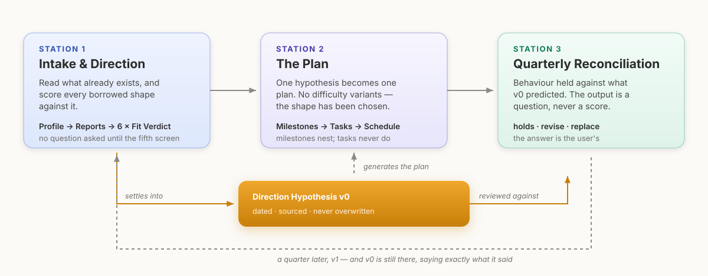
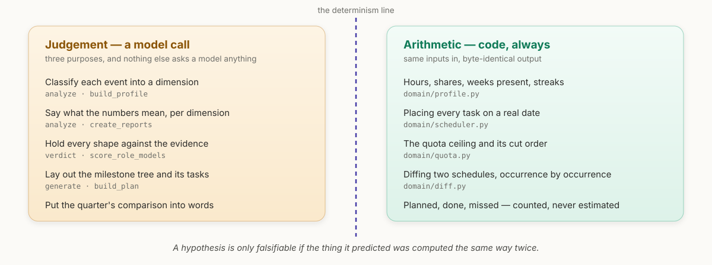
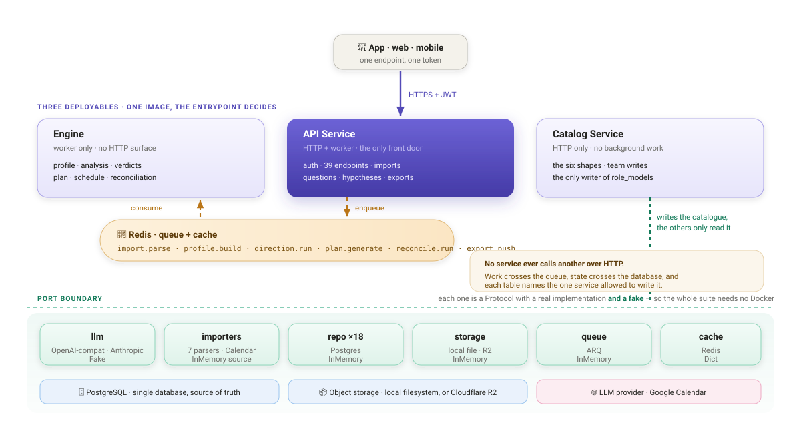

<div align="center">

# guru-core

**Find the shape your own data already supports, and one experiment to test it.**

Nobody can answer *"what is your vision?"* — it asks you to invent something from nothing.
So this service never asks. It reads the data you already have, offers borrowed shapes a
life can take, says which one your behaviour actually supports, and hands back a direction
you can prove wrong inside one quarter.

[](https://github.com/Quasar-Gang/guru-core/actions/workflows/ci.yml)
[](https://www.python.org/)
[](https://fastapi.tiangolo.com/)
[](https://www.postgresql.org/)
[](https://redis.io/)
[](https://mypy-lang.org/)
[](https://docs.astral.sh/ruff/)
[](LICENSE)

[How it works](#the-loop-is-the-product) · [Architecture](#architecture) ·
[Quick start](#quick-start) · [API guide](docs/api/README.md) ·
[Try the intake flow](https://wu0h9625-boop.github.io/guru-intake-prototype/)

</div>

---

## The loop is the product



A quarter is short enough that a wrong direction costs one season instead of five years, and
long enough that behaviour has time to say something. Four ideas hold the whole system up.

**1 · Read, don't ask.** People have left evidence for years — where the hours went, what
the résumé repeats, what they quietly stopped doing. It will not say what someone *wants*,
but it says what shape they are in, which is enough to borrow one and test it. The gap
between what a person claims to value and where their time actually goes **is** the
diagnosis.

**2 · Every shape states its cost.** `role_models.cost` is `NOT NULL` and a blank one is
rejected in the domain. A template with no stated trade-off turns the catalogue into a
popularity contest, won by whichever sounds best out loud.

**3 · One cheap test, not a five-year plan.** Every Fit Verdict ships exactly one Probe,
sized to a quarter, with its own stated cost. A test whose failure is survivable is a test
that gets run — that is the entire selection criterion.

**4 · The output is a hypothesis, never a vision.** `direction_hypotheses` is unique on
`(user_id, version)` and **no repository or route exposes an update**. A hypothesis you can
quietly edit can never be falsified: you would rewrite it to match whatever you ended up
doing, and learn nothing.

It chooses nothing. It reads, shows the evidence, states costs, and hands the decision back.

### The six shapes

Borrowed templates, not occupations — one job title can grow into different shapes. Users
can write their own, on the same terms and with the same cost rule.

| | Shape | The cost it names |
|---|---|---|
| **S-1** | **The Deep Specialist** — go deep on one thing, be known for it by your peers | Switching tracks gets expensive as depth grows |
| **S-2** | **The Zero-to-One Builder** — always making something that didn't exist | Little reaches maturity; the résumé looks jumpy |
| **S-3** | **The Independent Operator** — set your own hours, cover your own costs | Unstable income, no leverage, all the admin is yours |
| **S-4** | **The People Leader** — multiply through others instead of doing it yourself | Your hands-on craft decays; results become indirect |
| **S-5** | **The Steady Anchor** — predictable work, weight on relationships and health | The career ceiling arrives earlier; income flattens |
| **S-6** | **The Cross-Domain Connector** — stand between fields and translate | Deepest in none; constant explaining of what you do |

---

## Where the model is allowed to think



**This is a product requirement, not an engineering preference.** The Direction Hypothesis
is only falsifiable if the thing it predicted was computed the same way twice. If the
Schedule could drift between two runs of the same inputs, the quarterly review would be
comparing against noise.

So the pipeline follows one rule throughout — **numbers in code, meaning in the model**:

| Step | Model call? | Schema | Determinism |
|---|---|---|---|
| Parse and normalize uploads | no | — | deterministic |
| Build the Profile | classification only | `ProfileSignals` | hours, shares and streaks are arithmetic |
| Create the Reports | yes, one call for every dimension | `ReportSet` | metrics are attached afterwards, not narrated |
| Score the shapes | yes | `FitVerdictSet` | schema-validated: an uncited item is a failure, not a warning |
| Build the Milestone tree | yes, **relative** only | `PlanTemplate` | day hints and week ranges; never a date |
| **Place tasks on dates** | **no** | — | **byte-identical for the same inputs** |
| **Apply the quota and cut order** | **no** | — | **deterministic** |
| **Diff two schedules** | **no** | — | **deterministic** |
| Narrate the review | yes | `ReconciliationNote` | the comparison is computed first, then narrated |

Model output is validated twice — Pydantic for shape, then business rules for sense — and a
failure feeds the specific violation back for a retry. The rules are the domain's
invariants, not style preferences:

```
verdict for 'S-3' has 4 evidence items, and must have exactly 5
verdict for 'S-3' must carry at least one 'for' and at least one 'against' item
verdict for 'S-3' cites the 'money' dimension, which has no report in this run
task 'writing_block' fits no available time window; shorten it or widen its day_hint
```

If the retries run out, the plan degrades to a stated fallback and says so in
`structure.assumptions[]` rather than shipping a week nobody can survive.

---

## Architecture

Three independently deployable services share six packages, one PostgreSQL and one Redis.
**No service ever calls another over HTTP.** Work crosses the queue, state crosses the
database, and every table names the one service allowed to write it.



| Service | Shape | Owns |
|---|---|---|
| **API Service** | HTTP + worker | Auth, OAuth, every app-facing endpoint, import parsing, calendar export, the three questions, the quota, the append-only hypothesis |
| **Engine** | Worker only | The Profile, the Reports, the Fit Verdicts, the Milestone tree, the Schedule, the reconciliation |
| **Catalog Service** | HTTP only | The six shipped shapes and user-authored ones — the only writer of `role_models` |

Everything past the upload is a queue job, polled by the client, with PostgreSQL
authoritative and Redis only a cache:

| Job | Triggered by | Produces |
|---|---|---|
| `import.parse` | an upload completes | a `Document` |
| `profile.build` | a parse finishes, or a question is answered | the one Profile |
| `direction.run` | the user asks for an analysis | Reports, then a Fit Verdict per shape |
| `plan.generate` | a hypothesis is created | Milestones, Tasks, Schedule |
| `reconcile.run` | the review is opened | a Reconciliation |
| `export.push` | a plan is exported, or a task changes | the Schedule on a calendar |

### Hexagonal, enforced by tooling

Dependencies point one way only. `import-linter` fails the build on a reverse import, so the
rule cannot rot: layers per service, services independent of each other, `cmd/` thin, and no
framework or vendor SDK anywhere in a domain.



Every port has a real implementation **and** a fake, which is why the unit and application
suites need no Docker, no database and no network:

| Port | Real | Fake |
|---|---|---|
| `LLMPort` | `OpenAICompatLLM`, `AnthropicLLM` | `FakeLLM` (fixtures) |
| `StoragePort` | `LocalFileStorage`, `R2Storage` | `InMemoryStorage` |
| `QueuePort` | `ArqQueue` | `InMemoryQueue` |
| `CachePort` | `RedisCache` | `DictCache` |
| `XxxRepo` ×18 | `PgXxxRepo` | `InMemoryXxxRepo` |
| `CalendarPort` · `GoogleOAuthPort` · `GoogleOidcPort` | Google APIs over HTTPS | `FakeCalendar` · `FakeOAuth` · `FakeGoogleOidc` |
| `SourcePort` / `ParserPort` | 7 parsers, Google Calendar | `InMemorySource` |

Because the fakes satisfy the same protocols, the application suite wires the Engine to the
*same* in-memory repositories as the API — the way both share one PostgreSQL in production —
and drives the whole loop end to end without a container in sight.

### Four invariants the schema enforces

| Rule | Enforced by |
|---|---|
| One Profile per user | `profiles.user_id` **is** the primary key |
| Milestones nest; Tasks do not | `tasks.milestone_id` is `NOT NULL`, and there is no `tasks.parent_id` |
| A hypothesis is never overwritten | `uq_hypothesis_user_version`, plus no update method anywhere |
| Every Role Model states its cost | `role_models.cost` is `NOT NULL`, and a blank one is rejected |

The payoff for the second one is worth naming: **"done" always means the same thing.** The
moment tasks nest, completion becomes a weighted-average argument and every progress number
becomes a negotiation.

---

## Quick start

Requires Python 3.12, [uv](https://docs.astral.sh/uv/), PostgreSQL and Redis.

```bash
uv sync
cp .env.example .env                  # adjust as needed
uv run alembic upgrade head           # create the schema
uv run python -m cmd.seed_role_models # load the six shapes
make check                            # ruff → mypy --strict → import-linter → pytest
```

Run it, four processes:

```bash
uv run python -m cmd.api_server      # HTTP, port 8000
uv run python -m cmd.api_worker      # import.parse · export.push
uv run python -m cmd.engine_worker   # profile.build · direction.run · plan.generate · reconcile.run
uv run python -m cmd.catalog_server  # HTTP, port 8001
```

Or the whole stack in containers — **one image, and the entrypoint decides the role**:

```bash
make deploy env=local                 # build + up + migrate + seed
make deploy-smoke env=local           # the whole loop over HTTP, start to finish
make deploy-down env=local
```

Compose publishes postgres and redis on 5433 / 6380 so they do not collide with whatever is
already running. The stack reads fixtures by default; to point it at a real provider, put the
credentials in `deployment/local/.env.local` — the Makefile picks that file up automatically,
and it is gitignored because it carries a key:

```bash
LLM_ADAPTER=openai_compat
LLM_BASE_URL=https://api.x.ai/v1
LLM_API_KEY=xai-...
LLM_MODEL=grok-4.6
```

Scoring six shapes with five cited evidence items each is a large generation — around two
minutes against a hosted model — so `scripts/smoke.sh` waits up to `SMOKE_POLL_SECONDS`
(default 300) for each queued step.

`env=production` runs the same targets against a DigitalOcean Droplet — see
[`deployment/README.md`](deployment/README.md).

---

## Configuration

Everything lives in `config/` and environment variables. Swapping a vendor never touches
application code.

| File | Controls |
|---|---|
| `config/llm.yaml` | Provider, per-purpose parameters, context budgets, retry count |
| `config/report_dimensions.yaml` | The columns the Analyzer lays the data out in, and how far back a report looks |
| `config/scheduler.yaml` | Minimum gap between tasks, conflict shift limit, slot order |
| `config/quota.yaml` | What the schedule may spend before Q-3 has been answered |
| `config/tag_vocab.yaml` | Role Model tag namespaces and controlled values |
| `config/calendar_colors.yaml` | Google Calendar colour mapping |

<details>
<summary><b>Switching LLM provider</b> — environment variables only</summary>

<br>

Every field in `config/llm.yaml` is an environment variable with a default, so moving
between a laptop and a hosted API never touches the file or any use case.

| Setup | `LLM_ADAPTER` | `LLM_BASE_URL` | `LLM_STRUCTURED_OUTPUT` | `LLM_CONCURRENCY` | `LLM_REASONING_EFFORT` |
|---|---|---|---|---|---|
| Tests and development | `fake` | — | — | — | — |
| xAI Grok *(default)* | `openai_compat` | `https://api.x.ai/v1` | `json_schema` | `0` | `low` |
| Local Ollama | `openai_compat` | `http://127.0.0.1:11434/v1` | `json_schema` | `1` | `none` |
| Local vLLM | `openai_compat` | `http://localhost:8000/v1` | `guided_json` | `1` | *(blank)* |
| Claude | `anthropic` | *(blank)* | `tool_use` | `0` | *(blank)* |

The default model is `grok-4.6` (`LLM_MODEL`), 500K context, reached with an `xai-…` key in
`LLM_API_KEY`. It always reasons, so `none` is rejected — `low` is the cheapest effort it
accepts, and its reasoning tokens are billed on top of `max_tokens`, which caps the answer
only.

Two fields exist because a local runtime and a hosted API want opposite things:

- **`LLM_CONCURRENCY`** caps simultaneous requests per process. A local runtime holds one set
  of weights and one KV cache, so two generations contend for the same memory; `1` keeps a
  laptop predictable. Set `0` for a hosted provider, which has no such limit.
- **`LLM_REASONING_EFFORT`** is only sent when non-empty, because the accepted values are
  provider-specific and Anthropic has no such field. Leave it blank on a provider that does
  not take it — the Anthropic adapter never sends it regardless.

The whole system makes exactly five kinds of model call, under three purposes: `analyze`
(classify, report, narrate), `verdict` (score the shapes) and `generate` (lay out the plan).
Everything else is deterministic code. The local model baseline and the acceptance gates a
replacement must clear are in
[`docs/research/local-llm-evaluation.md`](docs/research/local-llm-evaluation.md).

</details>

<details>
<summary><b>Switching object storage</b> — local filesystem or Cloudflare R2</summary>

<br>

```bash
STORAGE_BACKEND=r2
R2_ACCOUNT_ID=...
R2_ACCESS_KEY_ID=...
R2_SECRET_ACCESS_KEY=...
R2_BUCKET=...
```

`container.py` is the only assembly point, so no use case changes. All three implementations
run the same contract test suite.

</details>

---

## Testing

```bash
make check          # ruff → mypy --strict → import-linter → pytest, no Docker
make integration    # integration tests against a live PostgreSQL
bash scripts/smoke.sh
```

| Suite | Needs | Runs in CI |
|---|---|---|
| Unit — domain, packages, docs | nothing | ✅ |
| Application — the whole loop through fakes | nothing | ✅ |
| Integration — the PostgreSQL repos | PostgreSQL | ✅ |
| Smoke — end to end over HTTP | the full stack | manual |

Every push runs lint, `mypy --strict`, the import contracts, both test suites and
`alembic check` against a real PostgreSQL — see
[`.github/workflows/ci.yml`](.github/workflows/ci.yml).

The heaviest coverage sits on the deterministic core and on the invariants: the scheduler,
the quota's cut order, the milestone-tree shape rules, the five-evidence-item rule, the
schedule diff and the state machines. That is where a regression would be invisible and
expensive. Two suites keep the documentation honest as well — a table added without a
schema-doc section, or a route added without a line in the API guide, fails the build.

---

## Documentation

| Document | What it covers |
|---|---|
| [`docs/api/README.md`](docs/api/README.md) | API guide — the call sequence behind each part of the product, with runnable examples |
| [`docs/api/openapi.json`](docs/api/openapi.json) · [`.yaml`](docs/api/openapi.yaml) | OpenAPI 3.1, exported from the running app |
| [`docs/db/schema.md`](docs/db/schema.md) | All 20 tables: columns, ownership, and why each shape was chosen |
| [`docs/research/local-llm-evaluation.md`](docs/research/local-llm-evaluation.md) | Local model selection, licence analysis, and the gates a replacement must clear |
| [`CONTRIBUTING.md`](CONTRIBUTING.md) | The engineering rules this codebase is held to |

Swagger UI and ReDoc are served live at `/docs` and `/redoc`. Regenerate the exported spec
after changing a route:

```bash
uv run python scripts/export_openapi.py
```

### Diagrams

The three SVGs above are hand-drawn, because each carries a layer of meaning a flowchart
cannot: the loop's return edge is what the whole product is, the determinism line is a rule
rather than a step, and the port boundary is drawn as a boundary with its fakes listed
underneath. Edit those files directly. `docs/diagrams/hexagonal-layers.mmd` is the one
mermaid source, rendered by:

```bash
uv run python scripts/render_diagrams.py   # opens a browser, writes docs/assets/*.svg
```

The generator only rebuilds SVGs whose name matches a `.mmd`, so it leaves the hand-drawn
ones alone.

---

## Repository layout

```
cmd/            entry points, ≤20 lines each, zero business logic
packages/       llm · importers · repo · storage · queue · cache · config · logging
services/
  api/          domain · application · adapters · container.py
  engine/       domain · application · adapters · container.py
  catalog/      domain · application · adapters · container.py
config/         yaml the code reads, never hard-coded
seeds/          the six shipped Role Models
migrations/     alembic — one migration, squashed
docs/           api reference · db schema · research · diagrams
tests/          unit · application · integration · fixtures
```

## License

Proprietary. Copyright (c) 2026 Quasar-Gang, all rights reserved — see
[`LICENSE`](LICENSE). No licence to use, copy, modify or distribute this software is granted
without written permission.
